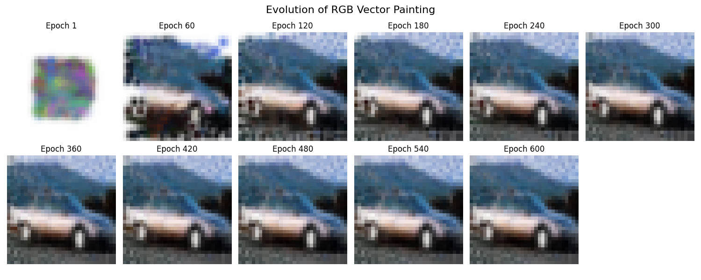

# Vectorizer AI: Differentiable RGB Painter

A neural-network-based image vectorizer that "paints" an image using differentiable Bezier strokes. Instead of traditional edge detection, it uses gradient descent to optimize the position, color, and opacity of each stroke to match a target image.



## 🚀 Features

- **Differentiable Rendering:** Uses PyTorch to backpropagate through the rendering process.
- **Bezier Strokes:** Each stroke is defined by a quadratic Bezier curve.
- **Painter's Algorithm:** Layers strokes with alpha blending for complex compositions.
- **Hardware Acceleration:** Supports CUDA (NVIDIA), DirectML (AMD), and CPU.
- **Sparsity Regularization:** Encourages the model to use fewer, more meaningful strokes.

## 🛠️ Installation

1. Clone the repository:
   ```bash
   git clone https://github.com/YOUR_USERNAME/vectorizer-ai.git
   cd vectorizer-ai
   ```

2. Install dependencies:
   ```bash
   pip install -r requirements.txt
   ```

3. (Optional) For AMD GPU acceleration on Windows:
   ```bash
   pip install torch-directml
   ```

## 📖 Usage

Simply run the main script to see it in action with a sample image from CIFAR-10:

```bash
python vectorizer.py
```

Results will be saved in the `results/figures/` directory.

## 🧠 How it works

1. **Initialization:** Start with a set of random Bezier curves on a blank canvas.
2. **Rendering:** For each pixel, calculate the distance to the nearest curve to create a stroke mask.
3. **Compositing:** Blend the strokes using the standard alpha-compositing formula (Painter's Algorithm).
4. **Optimization:** Compare the generated image with the target using Mean Squared Error (MSE).
5. **Backpropagation:** Adjust the stroke parameters (points, colors, alpha) to minimize the error.

## 📜 License

This project is licensed under the MIT License - see the [LICENSE](LICENSE) file for details.
